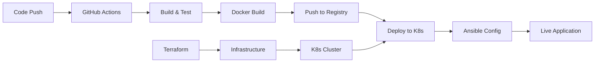

# Cloud-Native Web App Deployment Pipeline

     

## 🚀 Project Overview

This project demonstrates a **complete end-to-end automated deployment pipeline** for a cloud-native web application using modern DevOps tools and practices. The pipeline automates everything from infrastructure provisioning to application deployment and configuration management.

### 📋 What This Project Does

- **Provisions cloud infrastructure** automatically using Infrastructure as Code (IaC)
- **Containerizes** a web application for consistent deployments
- **Implements CI/CD** with automated testing, building, and deployment
- **Orchestrates containers** in a Kubernetes cluster
- **Configures applications and infrastructure** post-deployment
- **Demonstrates GitOps** workflow with version-controlled infrastructure

---

## 🏗️ Architecture & Technology Stack

### Technology Roles in Automation

| Technology | Primary Role | Automation Function |
|------------|-------------|-------------------|
| **🏗️ Terraform** | Infrastructure as Code | Provisions cloud resources (VMs, networks, K8s clusters) automatically |
| **🐳 Docker** | Containerization | Packages application into portable, consistent runtime environments |
| **⚙️ GitHub Actions** | CI/CD Pipeline | Automates build, test, deploy cycle triggered by code changes |
| **☸️ Kubernetes** | Container Orchestration | Manages, scales, and maintains containerized applications |
| **🔧 Ansible** | Configuration Management | Automates application and system configuration post-deployment |

---

## 🔄 Complete Automation Workflow



### Step-by-Step Automation Process

1. **Developer pushes code** to GitHub repository
2. **GitHub Actions triggers** automatically on code changes
3. **Terraform provisions** infrastructure (if needed)
4. **Docker builds** application container image
5. **Image is pushed** to container registry
6. **Kubernetes deploys** the application using manifests
7. **Ansible configures** application settings and environment
8. **Application is live** and accessible to users

---


## 🛠️ Detailed Technology Breakdown

### 1. 🏗️ **Terraform - Infrastructure as Code**

**Role in Automation:**
- **Infrastructure Provisioning**: Automatically creates cloud resources
- **Version Control**: Infrastructure changes are tracked in Git
- **Repeatability**: Same infrastructure can be created multiple times
- **Scalability**: Easy to modify resource sizes and counts

**What Terraform Does in This Project:**
```hcl
# Example: Terraform creates these resources automatically
- AWS EKS Cluster (or GKE/AKS)
- Virtual Private Cloud (VPC) and networking
- Security groups and IAM roles
- Load balancers and storage
- Node groups for Kubernetes workers
```

**Automation Benefits:**
- **No manual cloud console clicks**
- **Infrastructure changes are peer-reviewed** through pull requests
- **Consistent environments** (dev, staging, production)
- **Easy disaster recovery** and environment replication

### 2. 🐳 **Docker - Containerization**

**Role in Automation:**
- **Consistent Runtime**: Application runs the same everywhere
- **Isolation**: Dependencies packaged with the application
- **Portability**: Same container runs on any Docker-compatible system
- **Efficiency**: Fast startup and resource optimization

**What Docker Does in This Project:**
```dockerfile
# Dockerfile automates application packaging
FROM python:3.10-slim          # Base runtime environment
COPY app.py .                  # Application code
RUN pip install flask          # Install dependencies
EXPOSE 8080                    # Define network interface
CMD ["python", "app.py"]       # Startup command
```

**Automation Benefits:**
- **"Works on my machine" problem solved**
- **Automated dependency management**
- **Fast, consistent deployments**
- **Easy rollbacks** to previous versions

### 3. ⚙️ **GitHub Actions - CI/CD Pipeline**

**Role in Automation:**
- **Continuous Integration**: Automatically test code changes
- **Continuous Deployment**: Automatically deploy passing changes
- **Pipeline Orchestration**: Coordinates all automation steps
- **Event-Driven**: Triggers on Git events (push, PR, etc.)

**What GitHub Actions Does in This Project:**
```yaml
# Pipeline automatically executes these steps:
1. Checkout source code
2. Run application tests
3. Build Docker image
4. Push image to registry
5. Deploy to Kubernetes cluster
6. Run post-deployment scripts
7. Send notifications
```

**Automation Benefits:**
- **Zero-downtime deployments**
- **Automatic testing** prevents bad code going live
- **Fast feedback loop** for developers
- **Auditable deployment history**

### 4. ☸️ **Kubernetes - Container Orchestration**

**Role in Automation:**
- **Container Management**: Automatically manages container lifecycle
- **Scaling**: Automatically scales based on demand
- **Self-Healing**: Restarts failed containers automatically
- **Load Distribution**: Distributes traffic across healthy containers

**What Kubernetes Does in This Project:**
```yaml
# Kubernetes automatically manages:
apiVersion: apps/v1
kind: Deployment
metadata:
  name: cloud-app
spec:
  replicas: 3                    # Maintains 3 running instances
  selector:
    matchLabels:
      app: cloud-app
  template:
    spec:
      containers:
      - name: cloud-app
        image: myapp:latest      # Uses Docker image
        ports:
        - containerPort: 8080
```

**Automation Benefits:**
- **High availability** through automatic failover
- **Automatic scaling** based on CPU/memory usage
- **Rolling updates** with zero downtime
- **Service discovery** and load balancing

### 5. 🔧 **Ansible - Configuration Management**

**Role in Automation:**
- **System Configuration**: Automates server and application setup
- **Consistency**: Ensures all environments are configured identically
- **Compliance**: Maintains security and compliance standards
- **Post-Deployment**: Handles configuration after container deployment

**What Ansible Does in This Project:**
```yaml
# Ansible playbook automates configuration:
- name: Configure application environment
  hosts: k8s_nodes
  tasks:
    - name: Install monitoring agent
      package:
        name: prometheus-node-exporter
        state: present
    
    - name: Configure SSL certificates
      copy:
        src: ssl-cert.pem
        dest: /etc/ssl/certs/
    
    - name: Setup log rotation
      template:
        src: logrotate.j2
        dest: /etc/logrotate.d/app
```

**Automation Benefits:**
- **Idempotent operations** (safe to run multiple times)
- **Configuration drift prevention**
- **Automated compliance** and security hardening
- **Disaster recovery** automation

---

## 🎯 Why This Pipeline Architecture?

### Traditional Problems Solved:

| Problem | Solution |
|---------|----------|
| Manual deployments are error-prone | **Automated CI/CD pipeline** eliminates human error |
| Inconsistent environments | **Docker containers** provide identical runtime everywhere |
| Infrastructure changes break things | **Terraform** manages infrastructure as code with version control |
| Difficult to scale applications | **Kubernetes** provides automatic scaling and load balancing |
| Configuration drift over time | **Ansible** ensures consistent system configuration |
| Slow feedback on code changes | **GitHub Actions** provides immediate automated testing |

### Business Benefits:

- **Faster Time to Market**: Automated deployments reduce release cycles
- **Higher Reliability**: Automated testing and consistent environments
- **Cost Efficiency**: Infrastructure as code optimizes resource usage
- **Better Security**: Automated compliance and configuration management
- **Team Productivity**: Developers focus on features, not deployment issues

---

## 🚀 Getting Started

### Prerequisites

- Docker Desktop installed
- Git and GitHub account
- Cloud provider account (AWS/GCP/Azure) OR local Kubernetes (minikube/kind)
- Terraform installed
- Ansible installed
- kubectl installed

### Quick Setup

1. **Clone the repository:**
   ```bash
   git clone https://github.com/yourusername/cloud-app-pipeline.git
   cd cloud-app-pipeline
   ```

2. **Configure your environment:**
   ```bash
   # Copy and edit configuration files
   cp terraform/terraform.tfvars.example terraform/terraform.tfvars
   cp ansible/inventory/hosts.example ansible/inventory/hosts
   ```

3. **Set up GitHub Secrets:**
   - `DOCKERHUB_USERNAME`: Your Docker Hub username
   - `DOCKERHUB_TOKEN`: Docker Hub access token
   - `KUBE_CONFIG_DATA`: Base64 encoded kubeconfig file
   - `AWS_ACCESS_KEY_ID`: AWS access key (if using AWS)
   - `AWS_SECRET_ACCESS_KEY`: AWS secret key (if using AWS)

4. **Deploy infrastructure:**
   ```bash
   cd terraform
   terraform init
   terraform plan
   terraform apply
   ```

5. **Push code to trigger pipeline:**
   ```bash
   git add .
   git commit -m "Initial deployment"
   git push origin main
   ```

### Local Development Setup

For local testing without cloud resources:

```bash
# Start local Kubernetes cluster
minikube start

# Build and deploy locally
docker build -t cloud-app:local ./app
kubectl apply -f k8s/

# Test the application
kubectl port-forward svc/cloud-app-service 8080:80
```

---

## 📊 Monitoring and Observability

The pipeline includes automated monitoring setup:

- **Application logs** collected via Kubernetes
- **Infrastructure metrics** via Terraform-provisioned monitoring
- **Deployment status** tracked in GitHub Actions
- **System configuration** validated by Ansible

---

## 🔒 Security Considerations

Security is automated throughout the pipeline:

- **Container scanning** in CI/CD pipeline
- **Infrastructure security** via Terraform security groups
- **Secrets management** through Kubernetes secrets and Ansible vault
- **Compliance checks** automated via Ansible playbooks

---

## 🎓 Learning Outcomes

By working with this project, you'll understand:

1. **Infrastructure as Code** principles and practices
2. **Containerization** strategies and Docker best practices
3. **CI/CD pipeline** design and implementation
4. **Kubernetes** orchestration and management
5. **Configuration management** with Ansible
6. **GitOps workflows** and automation
7. **Cloud-native** application architecture

---

## 🤝 Contributing

1. Fork the repository
2. Create a feature branch (`git checkout -b feature/amazing-feature`)
3. Commit your changes (`git commit -m 'Add amazing feature'`)
4. Push to the branch (`git push origin feature/amazing-feature`)
5. Open a Pull Request

---

## 📝 License

This project is licensed under the MIT License - see the [LICENSE](LICENSE) file for details.

---

## 🙋‍♂️ Support

If you have questions or need help:

- Open an issue on GitHub
- Check the documentation in each tool's folder
- Review the troubleshooting section in `/docs/troubleshooting.md`

---

## 🔄 Next Steps

Potential enhancements to explore:

- **Add Helm charts** for more sophisticated Kubernetes deployments
- **Implement GitOps** with ArgoCD or Flux
- **Add comprehensive monitoring** with Prometheus and Grafana
- **Implement multi-environment** deployments (dev/staging/prod)
- **Add integration tests** and performance testing
- **Implement blue-green deployments** for zero-downtime releases

---

*This project demonstrates modern DevOps practices and serves as a foundation for understanding cloud-native application deployment automation.*